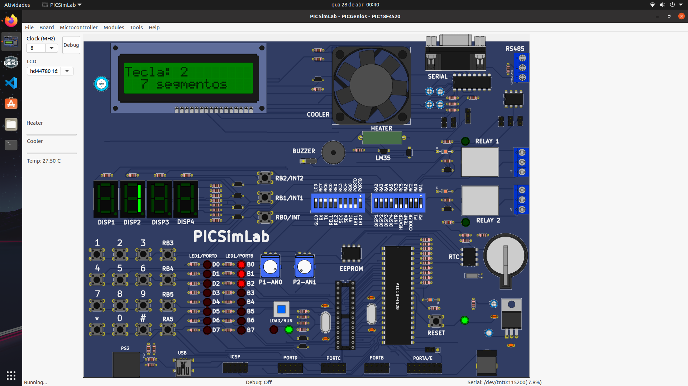
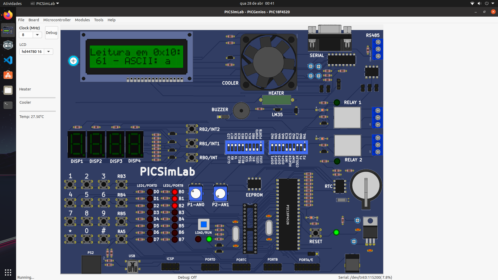
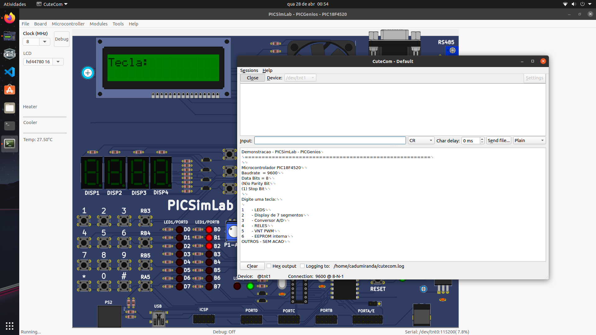

# PICSimLab-Demo-XC8

## Sistema Operacional utilizado para os testes: Linux Ubuntu 21.10

Código feito em linguagem Embedded-C de demonstração para o PIC18F4520 com a placa PICGenios, rodando a um clock de 8 MHz e um display LCD HD44780 16x02. 

# No teclado matricial...

Pressione (1) para ativar LEDS B <7:4>.

Pressione (2) para ativar o display de 7 segmentos.

Pressione (3) para ativar o TRIMPOT1 (P1-AN0) e fazer a conversão A/D. Note no LCD o valor do TRIMPOT.

Pressione (4) para ativar os relês.

Pressione (5) para ativar o PWM da ventoinha.

Pressione (6) para grava dado na memória EEPROM interna do PIC.

# USART

O acompanhamento do código pode ser feito através do canal USART. Para isso, foi feita a instalação e a configuração do tty0tty.

# OBS: Botões (7) (8) (9) (*) (0) e (#) NÃO executam nenhuma ação, mas podem ser programados para tal.
